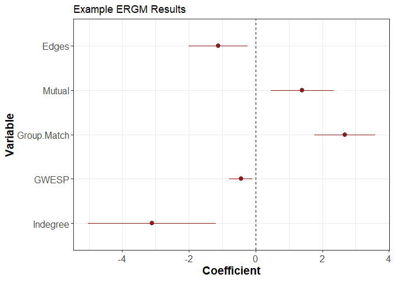
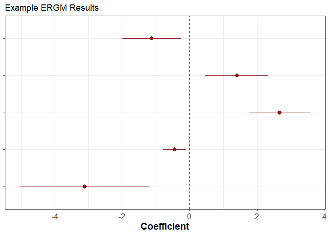

README
================

# ProcessResults

A package with some key functions for processing statistical modelling
results

## Plotting ERGM Results

The `ERGM_result_plot` function allows you to visualise/plot the results
from an ERGM (from `ergm` package output)

### Example - Run ERGM

First we run an ERGM on example data

``` r
library(ergm)

data('sampson')

model <- ergm(samplike ~ edges + mutual + nodematch('group') + 
            gwesp(decay = .5, fixed = TRUE) + 
            gwidegree(decay = 1, fixed = TRUE))

library(texreg)
screenreg(model,digits=3)
```

    ## 
    ## =============================
    ##                  Model 1     
    ## -----------------------------
    ## edges              -1.122 *  
    ##                    (0.447)   
    ## mutual              1.400 ** 
    ##                    (0.477)   
    ## nodematch.group     2.669 ***
    ##                    (0.467)   
    ## gwesp.fixed.0.5    -0.444 *  
    ##                    (0.173)   
    ## gwideg.fixed.1     -3.114 ** 
    ##                    (0.980)   
    ## -----------------------------
    ## AIC               270.791    
    ## BIC               289.409    
    ## Log Likelihood   -130.396    
    ## =============================
    ## *** p < 0.001; ** p < 0.01; * p < 0.05

### Plot Results

We can now create the plot

``` r
library(ProcessResults)
var_names<-c("Edges","Mutual","Group.Match","GWESP","Indegree")
ERGM_result_plot(model,var_names,plot_title = "Example ERGM Results") #Default is with y axis labels
```

<!-- -->

We can also plot this without the y-axis labels, which is useful for
panel plots of results with the same coefficients

``` r
library(ProcessResults)
var_names<-c("Edges","Mutual","Group.Match","GWESP","Indegree")
ERGM_result_plot(model,var_names,plot_title = "Example ERGM Results",y_axis_lab = FALSE)
```

<!-- -->
